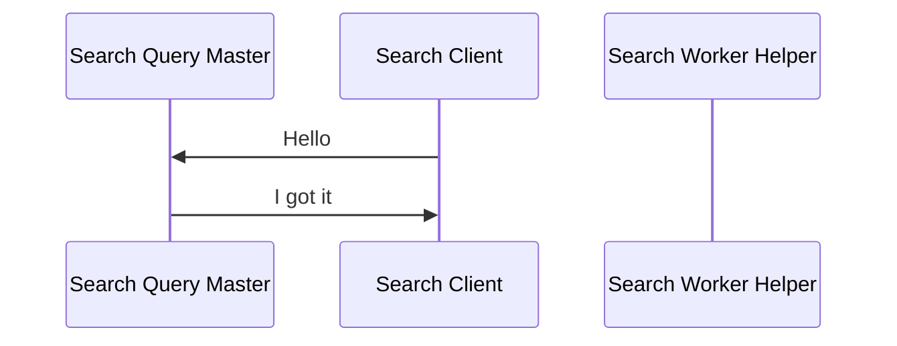

# 1. Indexer System

## 1.1. How to Run

```python indexer.py -fs [input_directory] -nodes [nodes] -host [system_host] -port [master_port]```

# 2. Search System Overview



## 2.1. How to Run

```python search.py -index [input_directory] -nodes [nodes] -host [system_host] -port [master_port]```
